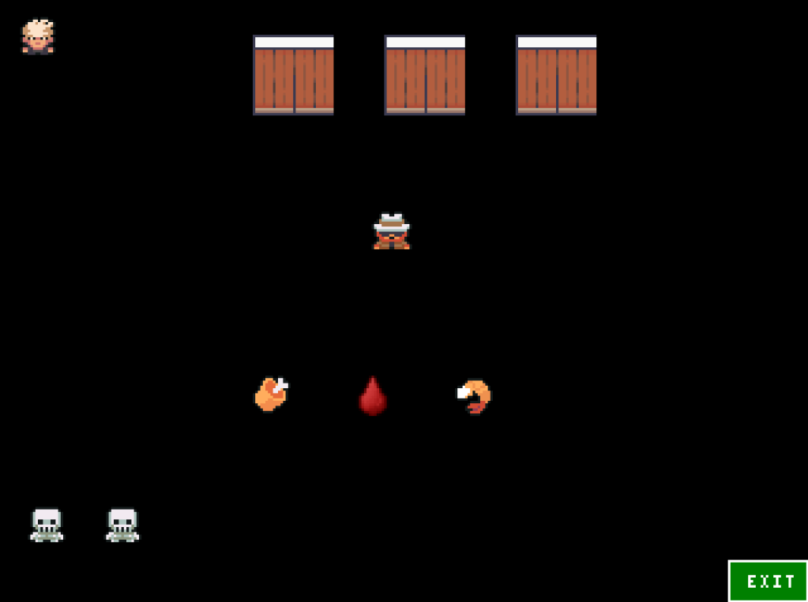

<h1 style="text-align:center;">Go Inspector</h1>

As always, made with love and enthusiasm ❤️

A 2D Pixel Art game, built in Go and Ebitengine.

&nbsp;&nbsp;

## Goal
You should find the hidden girl, ensure she escapes safely,
and you only win if you and the girl reach the exit alive.

### How to keep both of you alive until you escape ?
Well, that's the game !

## How to play 
- Use arrows or the keys `W, A, S, D` to move.
- Press `O` to open a door.
- Press `E` to eat a food.
- You can also push the food.

## Features
It has main 2D game features like : 
- Animated motion
- Collision and edge detection.
- Block-pushing mechanic.
- Attack and death logic.
- Damage and health logic
- Scene management.
- VFX.
